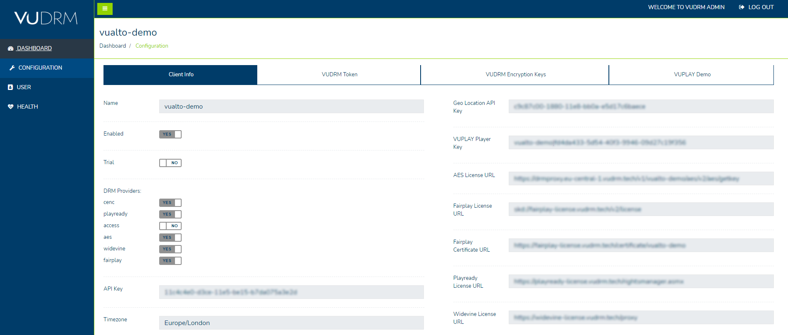
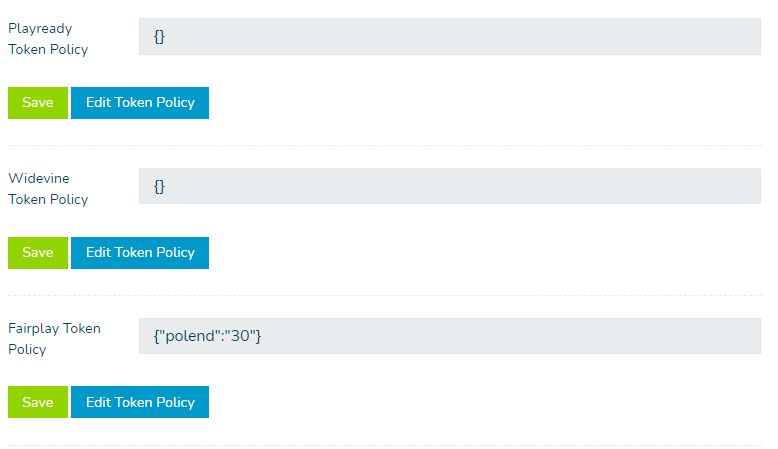

# VUDRM ADMIN

Our VUDRM Admin page gives you the tools you will need to test our DRM services with your content. If you need assistance or clarification in relation to anything in this guide, please contact [VUALTO support](support@vualto.com).

## Login

To access the VUDRM Admin site, please go to the [Admin Login page](https://admin.vudrm.tech/Account/Login) - login using the credentials on your onboarding documentation.

## Dashboard

Once you have successfully logged in, you will be redirected to the “Dashboard” page.

The dashboard will show you an overview of all DRM licenses served with your content.

By clicking on the “Range” dropdown field, you can set custom time frames to get an overview for that time period.

## Configuration

### Client Info

The “Client Info” section contains the details of how your account is configured, such as which DRM providers are enabled and which URLs have been set to retrieve each service's DRM licenses.

If you require amendments to your account, please contact [VUALTO support](support@vualto.com).

#### Client Info - Edit default token policies

Towards the bottom of the “Client Info” page, you can view each DRM service’s default token policy. This can be edited to give more control over how a service will act.

Each DRM service has limitations to how their policy can be altered. Please read the links below for more details:

* [DRM Policy](https://docs.vualto.com/projects/vudrm/en/latest/DeveloperDocumentation/VUDRM-token.html#drm-policy)
* [PlayReady DRM Policy](https://docs.vualto.com/projects/vudrm/en/latest/DeveloperDocumentation/VUDRM-token.html#playready-drm-policy)
* [Fairplay DRM Policy](https://docs.vualto.com/projects/vudrm/en/latest/DeveloperDocumentation/VUDRM-token.html#fairplay-drm-policy)
* [Widevine DRM Policy](https://docs.vualto.com/projects/vudrm/en/latest/DeveloperDocumentation/VUDRM-token.html#widevine-drm-policy)

### VUDRM Token

In this section, you can create, validate, decrypt, encode and decode VUDRM Tokens.

There are a variety of templates to choose from which will automatically populate the Policy text box, you can then generate a token with those parameters. You can also create custom policies as required. Click “Validate Policy” to verify that the policy entered is valid.

For an in depth guide of how our tokens work - please refer to the [VUDRM Token documentation](https://docs.vualto.com/projects/vudrm/en/latest/DeveloperDocumentation/VUDRM-token.html#). 

### VUDRM Encryption Keys

Within this section, you can call the CPIX Key Provider to fetch VUDRM Encryption Keys in CPIX XML document format as well as the CPIX keys as JSON which is generated at the same time, both of which are available to copy. 

We also have our “Legacy JSON Key provider” (available on the “Key Provider API” dropdown) to use if your product requires it.

For more information - please refer to our [Encryption Key Provision documentation](https://docs.vualto.com/projects/vudrm/en/latest/DeveloperDocumentation/VUDRM-key-provision.html#).

### VUPLAY Demo

VUPLAY is our internal demo player. By default, a token will be loaded into the player, however, you can copy and paste a token you created in the “VUDRM Token” section of the “Info” page. This can be used to test content with your variation of the token. 

The different options are as follows: 

* Default no DRM - this will play our demo content with no DRM
* Default DRM - this will play our demo content with DRM. A VUDRM Token is required to view it
* Custom Stream - this can be used to test custom content with a VUDRM Token. Your onboarding document contains a link to an encrypted video for you to use with the player. On request, we can encrypt your content for use with the player - good idea to include this!??!?!!?!?!?!!??!!?!?!

YouTube Player, Multiple Players and Skin are not needed to test content.

## User

On the User section of the VUDRM Admin site, you have the option of changing your password.

## Health

The health page gives an overview of the general health for each DRM or DRM related service we provide. If one of these services are down, it will be down throughout all regions.

By default, the page is set to auto-refresh every 60 seconds, but you can toggle this to no if not required.

The world map contains region specific services. A regions health colour will change in the following circumstances: 

* GREEN - All services are operational
* AMBER - 1 or more services are not operational
* RED - All services are not operational

