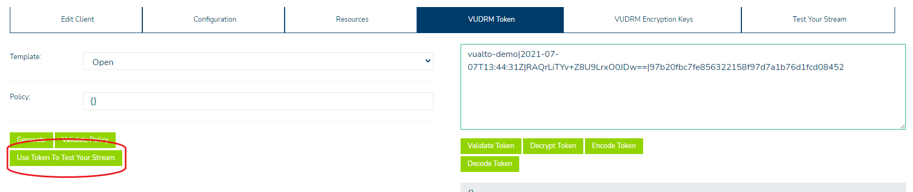
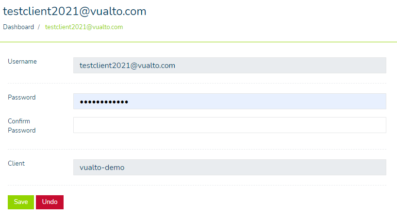
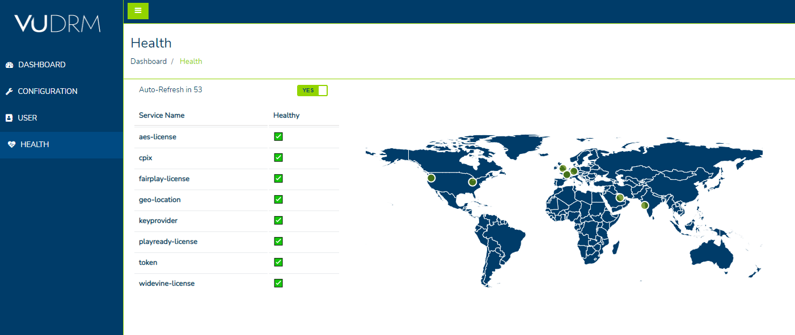

# USER GUIDE

Our Studio DRM Admin page gives you the tools you will need to test our DRM services with your content. If you need assistance or clarification in relation to anything in this guide, please contact <support@vualto.com>.

## Login

To access the Studio DRM Admin site, please go to the [Admin Login page](https://admin.vudrm.tech/Account/Login) - login using the credentials on your onboarding documentation.

## Dashboard

Once you have successfully logged in, you will be redirected to the `Dashboard` page.

The dashboard will show you an overview of all DRM licenses served with your content.

By clicking on the `Range` dropdown field, you can set custom time frames to get an overview for that time period.

## Configuration

### Client Info

The `Client Info` section contains the details of how your account is configured, such as which DRM providers are enabled and which URLs have been set to retrieve each service's DRM licenses.

If you require amendments to your account, please contact <support@vualto.com>.

#### Client Info - Edit default token policies

At the bottom of the `Client Info` page, you can view each DRM service’s default token policy. This can be edited to give more control over how a service will act by default.

Clicking `Edit Token Policy` will load the JSON editor. 

Please ensure that the JSON has been entered correctly, otherwise you will be informed of an error and will not be able to save the amended policy.

When the amends are complete, click `Close` and then `Save`. 

Each DRM service has limitations to how their policy can be altered. Please read the links below for more details:

* [DRM Policy](../DeveloperDocumentation/VUDRM-token.html#drm-policy)
* [PlayReady DRM Policy](../DeveloperDocumentation/VUDRM-token.html#playready-drm-policy)
* [FairPlay DRM Policy](../DeveloperDocumentation/VUDRM-token.html#fairplay-drm-policy)
* [Widevine DRM Policy](../DeveloperDocumentation/VUDRM-token.html#widevine-drm-policy)

### Studio DRM Token

In this section, you can create, validate, decrypt, encode, and decode Studio DRM Tokens.

There are a variety of templates to choose from which will automatically populate the `Policy` text box, please ensure that you replace all default values (such as `{"polend":"DD-MM-YYYY HH:MM:SS"}` to `{"polend":"09-05-2021 12:30:00"}`). When the default values have been changed, you can then generate a token with those parameters. 

The buttons on the page do the following:

* `Generate`        - This will generate a token to include the policy you have entered
* `Validate Policy` - This will ensure the policy is valid
* `Validate Token`  - Validate the token created
* `Decrypt Token`   - Decrypts the token
* `Encode Token`    - URL Encodes the token
* `Decode Token`    - URL Decodes the token

Once a token has been generated, a new button will appear - `Use Token To Test Your Stream`. 

Clicking `Use Token To Test Your Stream` will load the `Test Your Stream` player with the generated token in the `VUDRM Token` text box.

For an in depth guide of how our tokens work - please refer to the [Studio DRM Token documentation](../DeveloperDocumentation/VUDRM-token.html#). 

### Studio DRM Encryption Keys

Within this section, you can call the `CPIX Key Provider` to fetch Studio DRM Encryption Keys in CPIX XML document format as well as the CPIX keys as JSON which is generated at the same time, both of which are available to copy. 

To create an Encryption key, do the following:

* Select which Key Provider API you wish to use by using the `Key Provider API`
* Select which DRM Providers by changing the relevant providers button to `YES`
* Enter a relevant name in the `Content ID` text field
* Click `Generate`
* Click `Copy` to copy the newly created key

We also have our `Legacy JSON Key provider` (available on the `Key Provider API` dropdown) to use if your product requires it. However, we recommend you use the `CPIX Key Provider` whenever possible.

For more information - please refer to our [Encryption Key Provision documentation](../DeveloperDocumentation/VUDRM-key-provision.html#).

### Test Your Stream

Integrated into the Studio DRM Admin site is our internal demo player which can be used for testing your streams. 

A Studio DRM Token with an open policy is loaded into the `VUDRM Token` field used by the player. You can copy and paste a token you created in the `VUDRM Token` section of the `Info` page. This can be used to test content with your variation of the token. Alternatively, clicking the `Use Token To Test Your Stream` button within the `VUDRM Token` page will automatically enter that token into the Token field used by the player.

The fields are as follows: 

* `VUDRM Token`     - Token used by the player for the stream
* `DASH Stream URL` - DASH stream to test
* `HLS Stream URL`  - HLS stream to test

If you select the `Use Custom License Server URLs?` button, you will be presented with three fields available to edit:

* `Widevine License Server URL`
* `Playready License Server URL`
* `Fairplay License Server URL`

If these custom fields have values, they will override the default License Server URLs set within the client configuration.

Clicking `Load Player` will then load the content with the conditions of the filled in fields.

## User

On the `User` section of the Studio DRM Admin site, you have the option of changing your password.

## Health

The `Health` page gives an overview of the general health for each DRM or DRM related service we provide. If one of these services are down, it will be down throughout all regions.

By default, the page is set to auto-refresh every 60 seconds, but you can toggle this to `No` if not required.

The world map contains region specific services. A regions health colour will change in the following circumstances: 

* `GREEN`   - All services are operational
* `AMBER`   - 1 or more services are not operational
* `RED`     - All services are not operational
